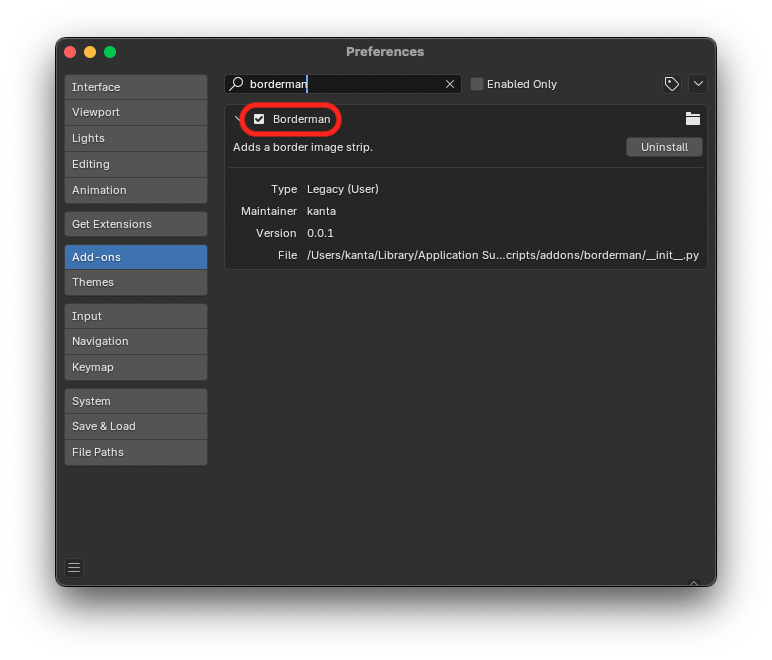

# borderman

BlenderのVSE内で、配置されたプレイスホルダーを枠線画像に置き換えるためのアドオンです。

## install

1. Blenderのアドオンディレクトリにプロジェクトをクローンする。

   - macOSの場合

   ```shell
   cd ~/Library/Application Support/Blender/<blender_version>/scripts/addons
   git clone https://github.com/kantas-spike/borderman.git
   ```

2. Blenderを起動し、`Preferences`-`Add-ons`から`Borderman`をチェックして有効にします。

   

## 使い方

本アドオンをインストール後、Blenderの **Video Editiong** を開くと、シーケンサー領域のサイドバーに**Borderman** タブが表示されます。
**Borderman** タブを選択すると、操作パネルが表示されます。

### 操作方法

1. **Borderman**パネルの`Add a placeholder`ボタンをクリックし、枠線の内側の領域をあらわすプレイスホルダーを追加します。[^1]
   1. 目的の位置、サイズになるように、プレイスホルダーのサイズや位置を調整します。
2. `Adding Border:`の設定で、枠線の形状(四角形 or 楕円)、枠線の色、枠線の太さ、および形状が四角形の場合は、角の丸みを指定します。
3. `Replace all placeholders`ボタンをクリックし、追加した全てのプレイスホルダーを枠線画像に置き換えます。
   1. もしくは、`Replace selected palceholders`ボタンをクリックし、選択した全てのプレイスホルダーを枠線画像に置き換えます。

[^1]: 複数のプレイスホルダーを追加することもできます。
